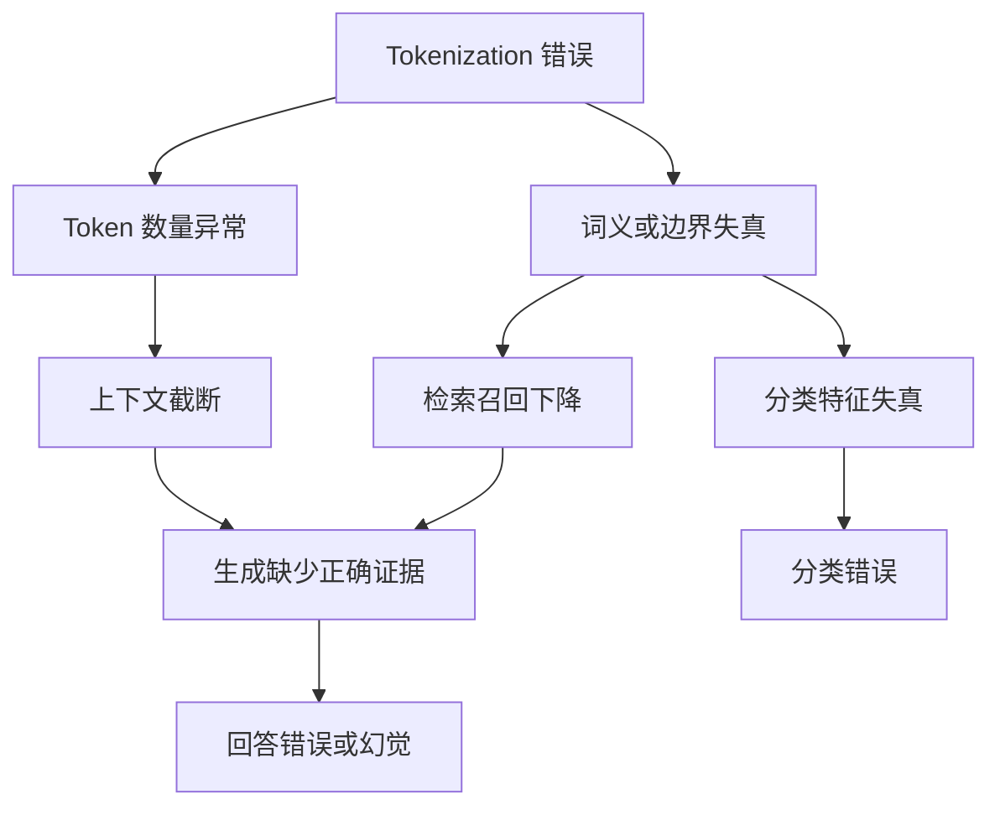

# 15. tokenization 错了会对检索、分类、生成分别造成什么影响？

## 回答

tokenization 的问题既包括切分过碎、边界不合理，也包括规范化不一致、特殊符号丢失或与模型不匹配。

- 检索：文档切块长度和查询编码会失真，关键实体、编号或术语可能被拆散；若索引端和查询端规范化不一致，召回会下降。
- 分类：重要词根、否定词、实体边界被错误处理后，模型特征会更噪声化，尤其会影响短文本和领域术语分类。
- 生成：输入占用更多上下文、格式标记被误解，模型可能更难复制代码、JSON、姓名或罕见词，也可能增加生成成本。

## 面试要点

工程上要保证训练、离线索引、在线查询和推理使用同一版本的 tokenizer 与相同的 normalization 规则。

Tokenization（分词/切词）错误会改变模型实际接收到的基本单元，进而影响检索、分类和生成三个环节。其核心问题是：文本表面不变，但模型看到的 token 序列、长度和语义边界发生了变化。

| 任务 | 主要影响         | 常见表现                 |
| -- | ------------ | -------------------- |
| 检索 | 查询与文档表示不一致   | 召回率下降、关键词失配、相似度偏低    |
| 分类 | 判别特征被拆散或错误合并 | 类别混淆、置信度下降、长文本截断     |
| 生成 | 输入理解和输出组织受损  | 答非所问、实体写错、重复、乱码或成本上升 |

### 1. 对检索的影响

检索通常最敏感，尤其是关键词检索、混合检索和领域术语检索。

* **词边界错误**：例如把“机器学习”切成无意义片段，会降低关键词匹配效果。
* **同一内容切分不一致**：查询和索引使用不同 tokenizer，可能导致相同字符串无法有效匹配。
* **专有名词被过度拆分**：产品型号、人名、医学术语、代码标识符等更容易漏召回。
* **未知字符或编码异常**：全角字符、特殊空格、Unicode 变体可能造成“看起来相同，实际不同”。
* **token 数膨胀**：文档分块边界改变，语义完整内容可能被拆到不同 chunk 中。
* **截断**：查询或文档超过长度限制后，关键限定条件可能被删除。

结果通常表现为 Recall@K、MRR、nDCG 和命中率下降。RAG 系统中，这还会进一步导致生成模型缺少正确证据。

### 2. 对分类的影响

分类依赖稳定的词形、实体、否定词和局部语序特征。

* 否定词切分错误可能把“不是退款问题”误判为“退款问题”。
* 领域词被拆散后，模型难以识别关键类别特征。
* 拼写、大小写或 Unicode 归一化不一致，会形成分布外 token 序列。
* token 数增加会挤占上下文窗口，使文本尾部被截断。
* 训练和推理阶段 tokenizer 不一致，会造成严重的数据分布偏移。

影响一般集中在边界样本、少数类别、短文本以及依赖精确实体的分类任务上，可通过准确率、Macro-F1、混淆矩阵和置信度校准误差观察。

### 3. 对生成的影响

生成模型通常能容忍轻微的子词拆分，但以下问题仍会产生明显影响：

* 输入中的关键实体被错误编码，导致实体理解或复制错误。
* 稀有词被拆成大量 token，增加推理成本和延迟。
* 上下文过度膨胀，引发截断或降低有效信息密度。
* RAG 检索错误向生成阶段传播，形成“基于错误上下文的流畅回答”。
* 输出 tokenizer 或解码配置错误可能造成字符缺失、乱码、异常空格和重复片段。

因此，生成质量下降不一定直接来自生成模型，也可能源于上游检索时的 tokenization 问题。

### 影响链路

### 降低影响的方法

* 训练、索引、查询和推理统一使用同一 tokenizer 及其版本。
* 在分词前统一 Unicode、大小写、空格、标点和全半角形式。
* 将领域术语、产品型号和特殊符号加入词表或 special tokens。
* 文档分块按语义边界处理，并保留适量重叠。
* 监控字符数/token 数比例，定位异常 token 膨胀。
* 建立包含生僻词、拼写错误、混合语言和特殊字符的鲁棒性测试集。
* 分别评估“正确检索条件下的生成”和“真实检索条件下的生成”，区分检索错误与生成错误。
* 对关键词要求严格的任务采用 BM25 与向量检索结合的混合检索。
