# 大模型里的 Token 应该怎样理解

## 执行摘要

在现代 NLP 和大模型里，**token 不是“字”、也不等于“词”**，而是模型真正处理的离散单位：它可能是一个完整单词、一个词片段、一个标点、一个带前导空格的片段，甚至是一串字节。训练和推理时，模型先把原始文本切成 token，再把 token 映射为 ID 和向量，交给 Transformer 做注意力计算，最后再把预测出的 token 序列解码回文本。也正因为如此，**上下文长度、计费、延迟、截断、跨语言体验**，本质上都更直接地受 token 数影响，而不是受“字数”或“词数”影响。citeturn9view0turn31view0turn40view0

从分词算法看，今天最常见的是 **BPE、WordPiece、SentencePiece Unigram**，外加两类重要边界方案：**字符级**和**字节级 BPE**。BPE通过反复合并高频相邻片段构造词表；WordPiece更强调“哪一对合并后最能提升似然”；Unigram从一个很大的候选词表开始，反过来删掉“贡献最小的片段”；字符级几乎没有 OOV 问题，但序列会很长；字节级 BPE以 256 个字节为基础词表，因此几乎天然避免 `unk`。这些设计没有绝对最好，只有在**压缩率、泛化能力、词表大小、跨语言公平性、推理成本**之间的取舍。citeturn13search4turn39view0turn15search0turn15search4turn40view0

不同模型家族的 tokenization 差别很大。BERT 用 WordPiece，经典英文模型是 30k 词表，并区分 cased/uncased；T5 用基于 SentencePiece 的 Unigram，32k 共享输入输出词表，并有 sentinel special tokens；LLaMA 早期版本使用基于 SentencePiece 的 BPE，典型词表 32k，而 Llama 3 文档则表明其 tokenizer 已转向 tiktoken 风格的 BPE；PaLM 使用 256k 的 SentencePiece 词表，且强调**无损、可逆、空白保留、Unicode OOV 落到 UTF-8 字节**；OpenAI 的 GPT 系列也不是一套 tokenizer 走到底，而是从 `r50k_base/p50k_base` 演进到 `cl100k_base/o200k_base` 等不同 encoding。citeturn33view0turn32view0turn35view0turn34view0turn36search6turn36search3turn37view0turn31view0

对工程实践而言，最重要的结论有四个。第一，**“1 token≈4 个英文字符”只是非常粗糙的经验值**，遇到中文、混合文本、emoji、空白、标点、代码时会明显失真。第二，**tokenization 会改变成本和有效上下文长度**：同样一段语义内容，如果被切成更多 token，就更贵、更慢、也更容易挤爆上下文。第三，**tokenization 不是中立预处理**，它会给不同语言带来“token 税”，影响公平性与效果。第四，做提示词和 API 设计时，应该围绕 token 来思考：先数 token，再决定截断、分块、批处理和缓存策略。citeturn9view0turn8search3turn8search11turn11search0turn11search18turn41view0

## 什么是 Token

在传统 NLP 里，“token”一度常常近似指“分词后的单位”，很多旧系统默认把空格切开的“词”当 token；但在 Transformer 时代，主流做法已经从“词级”转向“子词级”或“字节级”，因为纯词级方法词表太大，且无法优雅处理未登录词。Hugging Face 的总结很直接：现代 Transformer 常用 BPE、Unigram、WordPiece 这三类子词算法，让常见词保持完整、罕见词拆成更小片段。citeturn40view0

在大模型语境中，更精确的定义是：**token 是 tokenizer 把原始文本转换成离散序列后得到的基本符号**。这个符号先映射成一个整数 ID，再通过 embedding 层变成向量；模型不会“直接看字串”，而是“看 token ID 序列及其向量表示”。OpenAI 官方帮助文档也明确说明：文本会先被切成 tokens，模型处理这些 tokens，再把输出 token 序列转回文本。citeturn9view0turn12search15

因此，token 与“字”“词”“字符”之间只是**经常相关，但并不等价**。例如在英文里，一个 token 可能是 `" great"` 这样带前导空格的片段；OpenAI 官方示例还展示了同一个英文词 `red/Red` 因为大小写和句中位置不同，会被映射成不同 token。也就是说，token 的边界不仅取决于字面字符串，还取决于 tokenizer 的设计、训练语料中的频率模式以及预切分规则。citeturn31view0turn9view0

一个非常实用的理解方式是：**token 是“模型内部语言的字母表条目”**。人类看到的是自然语言字符串；模型真正消费和生成的是 token 序列。你在 API 里看到的 input/output/cached/reasoning tokens，本质上都是这个内部序列的长度统计，而不是自然语言层面的“字数”。citeturn9view0turn8search3turn8search11

## 主流分词算法

### BPE

BPE 的核心思想是：从较小的基本单位开始，反复把训练语料中**最常一起出现的相邻片段**合并成一个新 token，直到达到目标词表大小。Sennrich 等人把它系统地用于 NMT 的子词建模；Hugging Face 的教程则给出了清晰的现代实现描述：先预切成“词”，从字符表出发，迭代合并最高频相邻对。citeturn13search4turn40view0

BPE 的优点是实现简单、预测时确定性强、压缩率通常不错，而且非常适合大规模语料训练；缺点是它的合并准则是“频率”，不一定最符合语言学边界，也容易受到预切分规则强约束，例如空格切分会阻止某些跨词合并。典型词表规模随模型而变：原始 GPT 使用 BPE，词表约 40,478；很多现代开源 LLM 的 BPE 词表在 32k 到 100k 以上不等。citeturn40view0turn41view0

### WordPiece

WordPiece 与 BPE 很像，但**不是简单选最高频相邻对**，而是选“最能提升训练数据似然”的合并。Hugging Face 文档给出的直观解释是：它更偏好那些“共同出现远高于独立出现预期”的组合；Fast WordPiece 论文进一步说明，实际分词时 WordPiece 采用**greedy longest-match-first**，也就是在单词内部尽量优先取最长匹配前缀，匹配失败则整词回退到 `<unk>`。citeturn40view0turn39view0

WordPiece 的优点是通常比纯频率型 BPE 更“信息论导向”，并且与 BERT 生态深度绑定；缺点是 OOV 处理依赖词表和预处理策略，如果一个词无法按规则切开，可能直接落成 `[UNK]`。BERT 论文明确写到它使用 **30,000 WordPiece vocabulary**，并以 `[CLS]`、`[SEP]` 等 special tokens 组织输入。citeturn33view0

### SentencePiece 与 Unigram

SentencePiece 不是单一算法，而是一个**直接在原始句子上训练子词模型的框架**；它可以实现 BPE，也可以实现 Unigram。其关键价值在于：它不依赖先验空格分词，直接把原始文本当流处理，并把空格本身编码为特殊符号 `▁`。这对中文、日文等**不依赖空格分词的语言**尤其重要。citeturn15search4turn40view0

Unigram 的训练逻辑与 BPE 正好相反：它先假设一个很大的候选词表，然后估计每个候选片段的概率，再迭代删除那些“删除后损失增加最小”的片段，直到达到目标词表大小；推理时，它选择整句概率最高的切分，而不是按固定 merge 规则贪心合并。Kudo 的原始论文把这种方法与 subword regularization 结合起来，强调它天然支持**多种可能切分**与采样式训练。citeturn15search0turn40view0

它的优点是灵活、概率化、对多语言和无空格语言更友好；缺点是训练与推理概念上比 BPE 更复杂，也更依赖良好的概率估计。典型规模上，T5 采用基于 SentencePiece 的 tokenizer，使用 **32,000** 共享词表；PaLM 则把 SentencePiece 扩展到 **256k**，以支持大规模多语言与代码。citeturn35view0turn37view0

### 字符级 与 字节级 BPE

字符级 tokenization 最简单：一个字符一个 token。它几乎不会有 OOV 问题，但序列显著变长，导致注意力和缓存成本提高，也让模型更难在短距离内聚合语义。Hugging Face 文档明确指出，字符级的优点是小词表和无 `unk`，代价是更长序列和通常更差的性能。citeturn40view0

字节级 BPE 则是现代 LLM 的关键折中：不是把所有 Unicode 字符都放进基表，而是以 **256 个字节值**作为基础词表，再做 BPE 合并。这样几乎任何文本都能被编码，不需要把海量字符直接塞进词表。Hugging Face 文档指出，GPT-2 使用的就是字节级 BPE，词表规模为 **50,257**，其中包含 256 个字节 token、50,000 个 merges，以及一个 end-of-text special token。citeturn40view0turn7search15

### 一个便于实践记忆的对照表

| 方法 | 训练思路 | 预测时切分 | 典型优点 | 典型局限 | 典型词表规模 |
|---|---|---|---|---|---|
| BPE | 从小单位出发，反复合并最高频相邻对 | 按 learned merges 确定性切分 | 简单、稳定、压缩率常好 | 受预切分强约束，未必最符合语义边界 | 原始 GPT 约 40,478；现代常见 32k–50k+ citeturn40view0 |
| WordPiece | 选择最能提升似然的合并 | 最长前缀优先；失败可回退 `<unk>` | 与 BERT 生态兼容，语言建模友好 | OOV 处理不如字节方案鲁棒 | BERT 经典为 30k citeturn33view0turn39view0 |
| Unigram | 从大候选表开始，迭代删除贡献小的片段 | 选整句概率最高切分 | 更灵活，适合多语言与无空格语言 | 训练与解释相对更复杂 | T5 为 32k；多语言可扩到 128k/256k citeturn35view0turn37view0 |
| 字符级 | 直接按字符集建表 | 一个字符一个 token | 几乎无 OOV，概念最简单 | 序列长，效率和效果常吃亏 | 依字符集而定；通常显著小于子词表 citeturn40view0 |
| 字节级 BPE | 以 256 字节为基表再做 BPE | 字节/子词混合切分 | 几乎无 `unk`，对任意 Unicode 更鲁棒 | token 不再总是贴近人类词边界 | GPT-2 为 50,257 citeturn40view0 |

## 不同模型的 Tokenization 差异

不同模型家族最大的共同点是：**都把文本变成离散 token，再映射到 embedding**；最大的不同点是：**词表怎么建、空白/大小写怎么处理、OOV 怎么兜底、special tokens 怎么设计、多语言怎么平衡**。这些差异会直接影响 token 数、上下文利用率、训练效率与跨语言体验。citeturn31view0turn33view0turn37view0

| 模型家族 | 主要 tokenizer | 词表/encoding | OOV / 未知处理 | 常见 special tokens 与 casing | 多语言含义 |
|---|---|---|---|---|---|
| GPT 系列 | GPT-2 为字节级 BPE；新一些 OpenAI 模型按模型映射到 `r50k_base / p50k_base / cl100k_base / o200k_base` 等 encoding | GPT-2 明确为 50,257；新模型官方更强调“按模型取 encoding”而非统一一套词表 citeturn40view0turn31view0 | 字节级方案通常避免 `unk`；单 token decode 可能落在 UTF-8 边界外，因此官方建议按 bytes 看单 token citeturn31view0 | GPT-2 词表计入 end-of-text；空格常并入词首；大小写与上下文位置会改变 token 结果 citeturn40view0turn9view0 | 不同 encoding 对非英文字符的切分差异明显，不能拿一个模型的 token 统计外推到另一模型 citeturn31view0 |
| BERT | WordPiece | 经典 BERT 为 30k WordPiece citeturn33view0 | 无法切开的词可变成 `[UNK]`；中文有单独字符级处理路径 citeturn39view0turn32view0 | `[CLS]`、`[SEP]`、`[MASK]`；Uncased 会 lowercasing 并去掉重音，Cased 保留真实大小写与重音 citeturn33view0turn32view0 | mBERT 推荐 cased 版本；README 指出中国语料走字符级 tokenization，其他语言走 WordPiece citeturn32view0 |
| T5 | SentencePiece Unigram | 32k 共享输入/输出词表 citeturn35view0 | 默认有 `<unk>`；HF 文档列出 `<pad>`、`</s>`、`<unk>`；还支持 100 个 sentinel `extra_ids` citeturn34view0 | 特殊 token 对 span corruption 非常关键，例如 `<extra_id_0>` 等 sentinel citeturn34view0turn35view1 | T5 论文明确说其词表是为英德法罗等语言混合训练，模型因此只能处理一个预先固定的语言集合 citeturn35view0 |
| LLaMA | LLaMA/Llama 2 文档为基于 SentencePiece 的 BPE；Llama 3 文档说明转成基于 tiktoken 的 BPE | LLaMA/Llama 2 文档典型 `vocab_size=32000`；Llama 3 的实现文档强调 tokenizer 机制已变 citeturn36search6turn36search3 | LLaMA 系文档通常有 `<unk>`；很多实现默认没有 pad token，需要额外处理批处理与 attention mask citeturn36search6turn36search18 | 通常区分 `<s>`/`</s>` 等，并保持大小写；SentencePiece 风格意味着词首空格/`▁` 行为值得注意 citeturn4search1turn36search5 | 早期 LLaMA 的 32k 词表较偏英文学术/网络语料；英语中心 tokenizer 对某些非拉丁语种效率可能更差，这类“token 税”现象在跨语言研究中被系统记录 citeturn11search0turn11academia27 |
| PaLM | SentencePiece | 256k | 明确支持 OOV Unicode 按 UTF-8 bytes 回退；空白保留、可逆、数字逐位拆分 citeturn37view0 | 论文更强调“lossless and reversible vocabulary”，即 tokenization 尽量不丢原文信息 citeturn37view0 | 256k 的大词表就是为“大量语言 + 代码”服务，以减少过度切分 citeturn37view0 |

一个容易被忽略的点是：**“同一个模型家族”也可能发生 tokenizer 代际切换**。Llama 2 与 Llama 3 就是明显例子：前者文档强调 SentencePiece-based BPE，后者文档明确提到 tokenizer 已改为 tiktoken-based BPE。工程上，这意味着你不能只记“LLaMA 用 SentencePiece”这一句口诀，而必须看具体版本。citeturn36search5turn36search3

## Token 如何进入模型

从系统角度看，token 进入模型通常要经历这样一条链路：**原始文本 → 规范化/预切分 → tokenizer → token IDs → embedding/position → Transformer attention → 输出 logits → 采样/贪心选择 → token → 文本**。OpenAI 的帮助文档、BERT 论文与 Transformer 原始论文，从 API 视角、预训练视角和架构视角分别描述了这条链路的不同部分。citeturn9view0turn33view0turn6search9


最基础的一步是 **ID 到向量**。BERT 论文写得非常清楚：给定一个 token，其输入表示由 **token embedding、segment embedding、position embedding** 相加得到；其中 `[CLS]` 的最终隐藏状态常被拿来做分类，`[SEP]` 用于分隔句对。也就是说，token 只是“离散入口”，真正进入神经网络的是向量和位置信息的组合。citeturn33view0

位置处理并非所有模型都一样。Transformer 原始论文说明：由于模型没有 recurrence 和 convolution，必须显式注入位置信息，因此把 positional encodings 加到输入 embedding 上。BERT 使用的是显式位置 embedding；T5 文档则指出 T5 采用**相对位置**机制，因此左右侧 padding 都更自然；PaLM 论文进一步说明它使用 **RoPE embeddings** 而不是绝对或相对位置 embedding。citeturn6search9turn34view0turn37view0

进入 Transformer 之后，核心计算是注意力。原始 Transformer 论文把 attention 描述为：给定 query 与一组 key-value 对，输出是 value 的加权和；在自注意力里，query、key、value 都来自同一序列，不同位置的 token 会彼此交互。BERT 是**双向编码器**，每个 token 可以看左右文；GPT 类、LLaMA、PaLM 则是**因果解码器**，每个位置只能看左侧上下文；T5 则是**encoder-decoder**，解码器一边做 masked self-attention，一边 cross-attend 编码器输出。citeturn6search0turn33view0turn34view0

输出阶段，本质上是“在整个词表上做分类”。BERT 论文在 MLM 描述里明确说，mask 位置的最终隐藏向量会送到一个 over-the-vocabulary 的 output softmax；PaLM 论文还说明它共享 input-output embeddings，这是一种常见但并非普遍的设计。对自回归模型来说，生成时每一步都会从当前 hidden state 预测下一个 token，再重复这一过程。citeturn33view0turn37view0turn41view0

## 现实影响与边界情况

最常见的误解，是把 token 数和字符数、词数混为一谈。OpenAI 官方给出的经验值是：英文里 **1 token 大约约等于 4 个字符、约等于 3/4 个单词**；但它也马上提醒，**不同模型和不同 encoding 下的 tokenization 会变化**。这条经验只适合英文粗估，不适合作为中文、混合文本、代码、emoji 的精确预算。citeturn9view0turn31view0

空白、标点和大小写都很关键。OpenAI 官方 cookbook 指出，空格常常会并到词首，例如 `" is"` 而不是 `"is "`；OpenAI 帮助文档还给出 `red / Red / 句首 Red` 三种情况会得到不同 token 的示例。BERT 的 BasicTokenizer 会先做 lowercasing、accent stripping、标点切分，再进入 WordPiece；SentencePiece 则把空格显式记成 `▁`。同一句话，换一个 tokenizer，切分边界就可能完全不同。citeturn31view0turn9view0turn32view0turn40view0

CJK 与多语言是另一个大坑。BERT README 明确写到，多语 BERT 对中文使用字符级 tokenization，而对其他语言使用 WordPiece；SentencePiece 的设计初衷之一，就是避免假设“空格就是词边界”。T5 论文进一步承认，其 32k 词表是按若干目标语言混合训练的，因此词表覆盖是**预先固定的语言集合**；PaLM 则反过来用 256k 词表减少多语言语料的过度切分。citeturn32view0turn15search4turn35view0turn37view0

emoji、稀有 Unicode、数字和符号体现了 tokenizer 设计哲学的差异。字节级 BPE的意义，就在于把“任意字符都要进系统”这个问题转换成“任意字节都能表示”；PaLM 论文则更进一步，明确说其词表是**无损可逆**的，未知 Unicode 会拆成 UTF-8 bytes，数字总是拆成单个 digit tokens。这样做的好处是鲁棒、可逆、利于代码，代价是 token 边界可能不再贴近人类直觉。citeturn40view0turn37view0turn41view0

tokenization 还会带来系统性偏差。近期跨语言研究反复指出，很多英语中心 tokenizer 会让某些语言出现更高的 fragmentation rate，也就是同样语义内容被切成更多 token；这意味着更高的推理成本、更短的有效上下文，甚至更差的 in-context learning 表现。Petrov 等人直接把这种现象概括为 tokenizer 引入的不公平；Ahia 等人的研究则从“Do All Languages Cost the Same?” 的角度，把它与成本和效用差异联系起来。citeturn11search0turn11search3turn11search18

成本与延迟层面，现代 API 通常按 token 计费，而不是按字符或按请求统一收费。OpenAI 文档区分 input tokens、output tokens、cached tokens、reasoning tokens，并说明 API usage 按 token 计价；Anthropic 文档同样用 input/output/cache tokens 来定价与限流。对模型本体而言，token 越多，上下文就越长；而在自回归生成中，每生成一个 token 都需要再做一次前向传播，因此 tokenizer 的压缩率会实打实影响 FLOPs、KV cache 和记忆占用。citeturn8search3turn8search11turn8search2turn8search10turn41view0

## 示例与复现实验

### 官方公开示例

OpenAI 官方 cookbook 公开了不同 encoding 对同一字符串的切分结果。它非常适合说明一个关键事实：**新 tokenizer 并不总是“token 更少”，而是“切分规则不同”**。例如，在 `antidisestablishmentarianism` 这个词上，`r50k_base` 与 `cl100k_base` 的切法就不同；在 `2 + 2 = 4` 这类带空格和符号的短串上，`cl100k_base` 比 `r50k_base` 反而切得更细。citeturn31view0

| 字符串 | `r50k_base` | `cl100k_base` |
|---|---|---|
| `antidisestablishmentarianism` | 5 tokens：`ant` `idis` `establishment` `arian` `ism` | 6 tokens：`ant` `idis` `establish` `ment` `arian` `ism` |
| `2 + 2 = 4` | 5 tokens：`2` ` +` ` 2` ` =` ` 4` | 7 tokens：`2` ` +` ` ` `2` ` =` ` ` `4` |

这组例子说明了两件事：第一，**空格怎样并入 token** 会显著改变 token 数；第二，**“更先进的 tokenizer”不等于在所有字符串上都更短**，因为它也在重新权衡组合边界、数字与符号处理策略。citeturn31view0

### 可复现实验示例

下面这组结果是**说明性、可复现实验**：我使用一个极小的中英混合语料，分别训练了一个 **SentencePiece Unigram** 模型，以及一个 **SentencePiece BPE + byte fallback** 模型。它们**不是** T5 或 GPT-2 的官方词表，因此不应用来做商业模型精确计费；它们的用途是帮助你直观看到：中英混写、空格、问号、emoji，会如何在不同 tokenizer 下产生不同结果。

| 文本 | 字符数 | Unigram token 数 | Unigram 输出 | BPE+byte fallback token 数 | BPE+byte fallback 输出 |
|---|---:|---:|---|---:|---|
| `我想知道大模型的token怎么理解呢？` | 19 | 16 | `▁ 我 想 知 道 大 模 型 的 token 怎 么 理 解 呢 ?` | 17 | `▁ 我 想 知 道 大 模 型 的 t oken 怎 么 理 解 呢 <0x3F>` |
| `Tokenization affects cost and latency.` | 39 | 17 | `▁T okenization ▁a f f ec ts ▁co s t ▁ an d ▁la tenc y .` | 31 | `▁ T oken i z a t i o n ▁a f f e c t s ▁ c o s t ▁a n d ▁l a ten c y .` |
| `中文 mixed with English!` | 22 | 18 | `▁ 中 文 ▁m i x e d ▁w i t h ▁E ng li s h !` | 23 | `▁ 中 文 ▁ m i x e d ▁ w i t h ▁ E n g l i s h !` |
| `😀👍🏽` | 3 | 4 | `▁ 😀 👍 🏽` | 4 | `▁ 😀 👍 🏽` |
| `空格  和标点, 会影响吗？` | 12 | 13 | `▁ 空 格 ▁ 和 标 点 , ▁ 会 影 响 吗?` | 16 | `▁ 空 格 ▁ 和 标 点 , ▁ 会 影 响 <0xE5> <0x90> <0x97> <0x3F>` |
| `2 + 2 = 4` | 9 | 8 | `▁2 ▁ + ▁2 ▁ = ▁ 4` | 10 | `▁ 2 ▁ <0x2B> ▁ 2 ▁ <0x3D> ▁ 4` |

从这张表可以读出几个经验。其一，**英文压缩率高度依赖词表是否“见过”该字符串**，所以小词表会让英文被切得很碎；其二，**字节回退**会把某些符号拆成 `<0x..>` 形式，这正是“无损可逆”的代价；其三，**emoji 并不必然很贵**，但是否昂贵高度依赖 tokenizer 是否把它们收进词表、以及是否按字节回退。  

```mermaid
xychart-beta
    title "示例字符串中的字符数与 token 数"
    x-axis ["中文问句","英文句子","Emoji"]
    y-axis "数量" 0 --> 35
    bar "字符数" [19,39,3]
    bar "Unigram" [16,17,4]
    bar "BPE+byte fallback" [17,31,4]
```



这张小图只用于说明趋势：**“字符更多”不必然“token 更多”，反过来也一样**。英文句子在这个小实验里字符数虽然不算极高，但因为词表不够适配，被切成了远多于中文问句的 token；换到真实商业模型上，具体数字会变，但“tokenization 质量决定压缩率”这个工程事实不会变。citeturn41view0

### 工具与命令

如果你想复现或检查正式模型的 tokenization，最常用的三套工具分别是 OpenAI 的 `tiktoken`、Hugging Face 的 `transformers/tokenizers`、以及 Google 的 `sentencepiece`。OpenAI 官方 cookbook 直接推荐 `tiktoken` 来计数；Hugging Face 文档说明 `Tokenizers` 可用于高性能训练与推理；SentencePiece 官方仓库则给出了 Python 安装和 `SentencePieceProcessor` 的基本用法。citeturn31view0turn12search0turn12search6turn12search8

```bash
pip install tiktoken
pip install transformers tokenizers
pip install sentencepiece
```

下面是 OpenAI tokenizer 的最小复现代码。注意官方 cookbook 说明：第一次加载某些 encoding 时可能需要联网下载缓存；而真正精确的 token 数，应使用**目标模型对应的 encoding** 去测，而不是凭经验估算。citeturn31view0

```python
import tiktoken

text = "我想知道大模型的 token 怎么理解呢？"
enc = tiktoken.encoding_for_model("gpt-4o-mini")  # 或者直接 get_encoding("cl100k_base")
ids = enc.encode(text)
token_bytes = [enc.decode_single_token_bytes(i) for i in ids]

print("token_ids:", ids)
print("token_bytes:", token_bytes)
print("num_tokens:", len(ids))
```

如果你想看 Hugging Face 模型自己的 tokenizer，用 `AutoTokenizer` 最方便；这尤其适合比较 BERT、T5、LLaMA 等模型家族的差异。citeturn21view0turn34view0turn36search5

```python
from transformers import AutoTokenizer

texts = [
    "Tokenization affects cost and latency.",
    "中文 mixed with English!",
]

for model_name in [
    "google-bert/bert-base-uncased",
    "google-t5/t5-small",
    "meta-llama/Llama-2-7b-hf",
]:
    tok = AutoTokenizer.from_pretrained(model_name)
    print(f"\n=== {model_name} ===")
    for t in texts:
        out = tok(t, add_special_tokens=False)
        pieces = tok.convert_ids_to_tokens(out["input_ids"])
        print(t)
        print(pieces, len(pieces))
```

如果你要训练或加载 SentencePiece 模型，官方 Python 接口也非常直接。citeturn12search8turn15search13

```python
import sentencepiece as spm

# 训练一个 Unigram 模型
spm.SentencePieceTrainer.Train(
    "--input=corpus.txt "
    "--model_prefix=demo_unigram "
    "--model_type=unigram "
    "--vocab_size=32000 "
    "--character_coverage=0.9995"
)

sp = spm.SentencePieceProcessor(model_file="demo_unigram.model")
pieces = sp.encode("我想知道 token 怎么理解", out_type=str)
ids = sp.encode("我想知道 token 怎么理解", out_type=int)

print(pieces)
print(ids)
print(sp.decode(ids))
```

## 实务建议与参考资料

### 实务建议

第一，**提示词设计先做 token 预算，再谈措辞优化**。因为模型真正受限的是 token window，不是字数。对英文粗估可以用“1 token≈4 字符”，但上线前必须用目标 tokenizer 实测；否则你在中文、代码、混合输入上很容易低估成本和截断风险。citeturn9view0turn31view0

第二，**截断不要按字符截，应该按 token 截**。OpenAI 文档已经把“缩短/重写 prompts、把大文本拆成更小 chunks、先摘要再发送”列为超限时的直接手段。对长文档检索、RAG、会议纪要、源代码这类场景，先按 token 切块，再预留输出预算，会比“拍脑袋按字数切”稳定得多。citeturn9view0

第三，**批处理和 padding 要考虑 tokenizer 与模型架构**。BERT 这类 encoder 模型天然依赖 attention mask，句对还会用 segment embedding；T5 文档明确指出它能处理左右 padding，因为它使用相对位置；LLaMA 系列不少实现默认没有 pad token，这会影响 batch tokenization、attention mask 和生成行为。也就是说，批处理不是“把 string 拼起来”那么简单，而是 tokenizer、special tokens、pad 策略一起设计。citeturn33view0turn34view0turn36search18

第四，**多语言输入不要默认公平**。如果你的产品面向中文、阿拉伯语、印地语、土耳其语、表情密集文本或代码用户，必须单独评估 token inflation。已有研究表明，不同语言会因为 tokenizer 设计而承受不同的 token 税，这既影响 API 成本，也影响有效上下文与模型质量。citeturn11search0turn11search18

第五，**不要把“更少 token”绝对化为“更好 tokenizer”**。更大的词表或更强压缩率，的确可能减少序列长度、降低 cache 压力、提高有效上下文；但相关研究也提醒，词表变大同样会增加 embedding/output 层成本，而且更长的词片段未必总有利于下游任务。工程上应把 tokenizer 看成一个**压缩率—泛化—算力—公平性**的联合优化问题。citeturn41view0

### 核心参考资料

以下资料最值得作为“一手来源”长期留存：

**原始论文**
- Vaswani 等，*Attention Is All You Need*。位置编码、self-attention、encoder-decoder 的基础。citeturn6search0turn6search9
- Sennrich 等，*Neural Machine Translation of Rare Words with Subword Units*。BPE 进入现代 NLP 的经典来源。citeturn13search4
- Schuster 与 Nakajima，*Japanese and Korean Voice Search*。WordPiece 源流。citeturn13search0turn13search1
- Wu 等，*Google’s Neural Machine Translation System*。WordPieces 在大规模系统中的关键工程化使用。citeturn14search0turn14search4
- Devlin 等，*BERT*。30k WordPiece、`[CLS]`/`[SEP]`、token+segment+position embeddings。citeturn33view0
- Kudo，*Subword Regularization*。Unigram 语言模型分词与采样式切分。citeturn15search0
- Kudo 与 Richardson，*SentencePiece*。直接在原始句子上训练 BPE/Unigram、用 `▁` 表示空格。citeturn15search4turn15search2
- Raffel 等，*T5*。SentencePiece 词表、32k vocabulary、sentinel tokens。citeturn35view0turn35view2
- Radford 等，*Language Models are Unsupervised Multitask Learners*。GPT-2 论文。citeturn7search15
- Chowdhery 等，*PaLM*。256k SentencePiece、可逆词表、UTF-8 byte fallback。citeturn37view0

**官方与实现文档**
- OpenAI Help：*What are tokens and how to count them?* API 计费和 token 类别的官方解释。citeturn9view0
- OpenAI Cookbook：*How to count tokens with tiktoken*。不同 OpenAI encodings 的官方对照示例。citeturn31view0
- Hugging Face：*Tokenization algorithms*。BPE、WordPiece、Unigram、SentencePiece 的工程化总结。citeturn40view0
- Hugging Face：BERT、T5、Llama/Llama2/Llama3 文档。看具体模型 tokenizer 行为最方便。citeturn34view0turn36search5turn36search3turn36search6
- SentencePiece 官方仓库。安装、训练、加载与 detokenize 的第一手实现资料。citeturn12search2turn12search8

### 开放问题与局限

本文最需要你留意的局限只有一条：**tokenization 是强模型依赖、强版本依赖的**。因此，示例部分我分成了两类：一类是 OpenAI 官方公开的 encoding 对照；另一类是可复现实验用的小型 SentencePiece 模型。后者用于解释机制，**不是**某个商用模型的精确计费依据。真正上线时，仍应对目标模型调用其官方 tokenizer 或 `encoding_for_model()` 做实测。citeturn31view0turn9view0